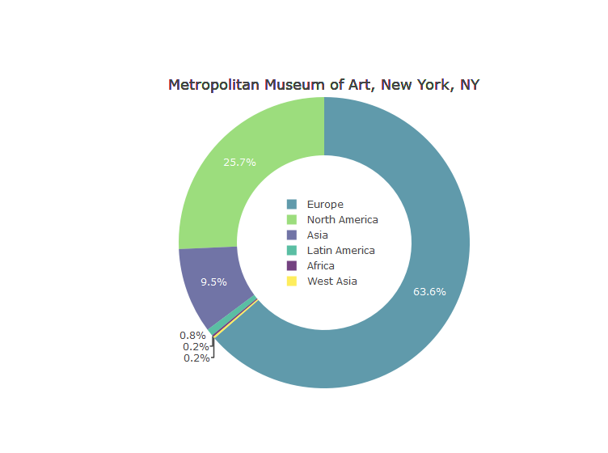

Artist\_donut\_plots\_md
================
Gregory Barber
April 2, 2019

``` r
#Loaded in Libraries
library(tidyverse)
library(plotly)
library(RColorBrewer)
library(reshape2)
library(viridis)
```

``` r
path <- 'https://raw.githubusercontent.com/artofstat/ArtistDiversity/master/artistdata.csv'
artists <- read.csv(path)
```

``` r
geodf <- artists %>% select(museum, GEO3major) %>% group_by(museum) %>% 
  summarize(Africa=round(100*prop.table(table(GEO3major))[1],1), 
            Asia=round(100*prop.table(table(GEO3major))[2],1), 
            Europe=round(100*prop.table(table(GEO3major))[3],1), 
            "Latin America"=round(100*prop.table(table(GEO3major))[4],1), 
            "North America"=round(100*prop.table(table(GEO3major))[5],1), 
            "West Asia"=round(100*prop.table(table(GEO3major))[6],1)
  )
#geodf

Group <- c(2,3,3,1,3,3,1,4,1,3,4,1,2,1,2,4,5,2)

geodf <- cbind(Group, geodf)

#geodf
```

``` r
art_long <- melt(geodf, id.vars = c("Group","museum"),value.name="Percent", variable.name = "Region") %>%
  arrange(museum)
#head(art_long)
```

``` r
#colors2 <-brewer.pal(6,"Spectral")
colors3 <- viridis(6, alpha = .75, begin = 0, end = 1) #[c(1,12,5,1,8,6)]
one_m <- filter(art_long, museum == "Metropolitan Museum of Art, New York, NY")

p <- one_m %>% plot_ly(hovertext = ~paste("<b>Region:<b>",one_m$Region,"<br>Percent:",one_m$Percent,"%"),
                       hoverlabel =list(font = list(size = 12)),
                       labels = ~Region, values = ~Percent, 
                       textinfo = paste(one_m$Percent), hoverinfo = "text",
                       insidetextfont = list(color = '#FFFFFF'),
                       marker = list(colors=colors3)
                       ) %>%
  add_pie(hole = 0.6) %>%
  layout(title = '') %>%
  layout(margin = list(t = 80),annotations = list(text = as.character(one_m$museum),showarrow = FALSE, align = 'right', y = 1.08, font = list(size = 18), yref = "paper"))%>%
  layout(legend = list(x = 0.4,y = 0.5, align = 'right'))

p
```

<!-- -->

# Group 1

``` r
p <- art_long %>%
  filter(Group == 1)%>%
  arrange(factor(Region, levels =  c("Europe",
                                 "North America",
                                 "Asia",
                                 "Latin America",
                                 "Africa",
                                 "West Asia")))
colors3 <- viridis(6, alpha = .75, begin = 0, end = 1)
M_list <- distinct(p, museum)

plot_vec <- list()
domain_list <- list(list(x = c(1, 2)),list(x = c(-1, -4)),list(x = c(3,6)),list(x = c(0.1, 0.7)),list(x = c(0.9, 1)))

for (i in seq(1,nrow(M_list))){
  x <- filter(p, museum == M_list[i,])
  k <- x %>% plot_ly(sort = FALSE,hovertext = paste("<b>Region:<b>",x$Region,"<br>Percent:",x$Percent,"%"),
                       hoverlabel =list(font = list(size = 12)),
                       labels = ~Region, values = ~Percent, 
                       textinfo = paste(x$Percent), hoverinfo = "text",
                       insidetextfont = list(color = '#FFFFFF'),
                       marker = list(colors=colors3,
                                     domain = domain_list[i])
                       ) %>%
  add_pie(hole = 0.6) %>%
  layout(title = '') %>%
  layout(margin = list(t = 80),annotations = list(text = as.character(x$museum),showarrow = FALSE, align = 'right', y = 1.08, font = list(size = 18), yref = "paper"))%>%
  layout(legend = list(x = 0.4,y = 0.5, align = 'right'))
  plot_vec <- append(plot_vec, list(k))
}
```

``` r
#Sub plots seem to have an issue with polar plots
subplot(plot_vec[[1]],plot_vec[[2]], nrows = 2, margin = 10)
```

    ## Warning: 'layout' objects don't have these attributes: 'NA'
    ## Valid attributes include:
    ## 'font', 'title', 'titlefont', 'autosize', 'width', 'height', 'margin', 'paper_bgcolor', 'plot_bgcolor', 'separators', 'hidesources', 'showlegend', 'colorway', 'datarevision', 'template', 'dragmode', 'hovermode', 'hoverdistance', 'spikedistance', 'hoverlabel', 'selectdirection', 'grid', 'calendar', 'xaxis', 'yaxis', 'ternary', 'scene', 'geo', 'mapbox', 'polar', 'radialaxis', 'angularaxis', 'direction', 'orientation', 'editType', 'legend', 'annotations', 'shapes', 'images', 'updatemenus', 'sliders', 'barmode', 'bargap', 'mapType'

<!-- -->

``` r
plot_vec[[1]]
```

<!-- -->

``` r
plot_vec[[2]]
```

<!-- -->

``` r
plot_vec[[3]]
```

<!-- -->

``` r
plot_vec[[4]]
```

<!-- -->

``` r
plot_vec[[5]]
```

<!-- -->

# Group 2

``` r
p <- art_long %>%
  filter(Group == 2)%>%
  arrange(factor(Region, levels =  c("Europe",
                                 "North America",
                                 "Asia",
                                 "Latin America",
                                 "Africa",
                                 "West Asia")))
colors3 <- viridis(6, alpha = .75, begin = 0, end = 1)
M_list <- distinct(p, museum)

plot_vec <- list()
domain_list <- list(list(x = c(1, 2)),list(x = c(-1, -4)),list(x = c(3,6)),list(x = c(0.1, 0.7)),list(x = c(0.9, 1)))

for (i in seq(1,nrow(M_list))){
  x <- filter(p, museum == M_list[i,])
  k <- x %>% plot_ly(sort = FALSE,hovertext = paste("<b>Region:<b>",x$Region,"<br>Percent:",x$Percent,"%"),
                       hoverlabel =list(font = list(size = 12)),
                       labels = x$Region, values = x$Percent, 
                       textinfo = paste(x$Percent), hoverinfo = "text",
                       insidetextfont = list(color = '#FFFFFF'),
                       marker = list(colors=colors3,
                                     domain = domain_list[i])
                       ) %>%
  add_pie(hole = 0.6) %>%
  layout(title = '') %>%
  layout(margin = list(t = 80),annotations = list(text = as.character(x$museum),showarrow = FALSE, align = 'right', y = 1.08, font = list(size = 18), yref = "paper"))%>%
  layout(legend = list(x = 0.4,y = 0.5, align = 'right'))
  plot_vec <- append(plot_vec, list(k))
}
```

``` r
plot_vec[[1]]
```

<!-- -->

``` r
plot_vec[[2]]
```

<!-- -->

``` r
plot_vec[[3]]
```

<!-- -->

``` r
plot_vec[[4]]
```

<!-- -->

# Group 3

``` r
p <- art_long %>%
  filter(Group == 3)%>%
  arrange(factor(Region, levels =  c("Europe",
                                 "North America",
                                 "Asia",
                                 "Latin America",
                                 "Africa",
                                 "West Asia")))
colors3 <- viridis(6, alpha = .75, begin = 0, end = 1)
M_list <- distinct(p, museum)

plot_vec <- list()
domain_list <- list(list(x = c(1, 2)),list(x = c(-1, -4)),list(x = c(3,6)),list(x = c(0.1, 0.7)),list(x = c(0.9, 1)))

for (i in seq(1,nrow(M_list))){
  x <- filter(p, museum == M_list[i,])
  k <- x %>% plot_ly(sort = FALSE,hovertext = paste("<b>Region:<b>",x$Region,"<br>Percent:",x$Percent,"%"),
                       hoverlabel =list(font = list(size = 12)),
                       labels = ~Region, values = ~Percent, 
                       textinfo = paste(x$Percent), hoverinfo = "text",
                       insidetextfont = list(color = '#FFFFFF'),
                       marker = list(colors=colors3,
                                     domain = domain_list[i])
                       ) %>%
  add_pie(hole = 0.6) %>%
  layout(title = '') %>%
  layout(margin = list(t = 80),annotations = list(text = as.character(x$museum),showarrow = FALSE, align = 'right', y = 1.08, font = list(size = 18), yref = "paper"))%>%
  layout(legend = list(x = 0.4,y = 0.5, align = 'right'))
  plot_vec <- append(plot_vec, list(k))
}
```

``` r
plot_vec[[1]]
```

<!-- -->

``` r
plot_vec[[2]]
```

<!-- -->

``` r
plot_vec[[3]]
```

<!-- -->

``` r
plot_vec[[4]]
```

<!-- -->

``` r
plot_vec[[5]]
```

<!-- -->

# Group 4

``` r
p <- art_long %>%
  filter(Group == 4)%>%
  arrange(factor(Region, levels =  c("Europe",
                                 "North America",
                                 "Asia",
                                 "Latin America",
                                 "Africa",
                                 "West Asia")))
colors3 <- viridis(6, alpha = .75, begin = 0, end = 1)
M_list <- distinct(p, museum)

plot_vec <- list()
domain_list <- list(list(x = c(1, 2)),list(x = c(-1, -4)),list(x = c(3,6)),list(x = c(0.1, 0.7)),list(x = c(0.9, 1)))

for (i in seq(1,nrow(M_list))){
  x <- filter(p, museum == M_list[i,])
  k <- x %>% plot_ly(sort = FALSE,hovertext = paste("<b>Region:<b>",x$Region,"<br>Percent:",x$Percent,"%"),
                       hoverlabel =list(font = list(size = 12)),
                       labels = ~Region, values = ~Percent, 
                       textinfo = paste(x$Percent), hoverinfo = "text",
                       insidetextfont = list(color = '#FFFFFF'),
                       marker = list(colors=colors3,
                                     domain = domain_list[i])
                       ) %>%
  add_pie(hole = 0.6) %>%
  layout(title = '') %>%
  layout(margin = list(t = 80),annotations = list(text = as.character(x$museum),showarrow = FALSE, align = 'right', y = 1.08, font = list(size = 18), yref = "paper"))%>%
  layout(legend = list(x = 0.4,y = 0.5, align = 'right'))
  plot_vec <- append(plot_vec, list(k))
}
```

``` r
plot_vec[[1]]
```

<!-- -->

``` r
plot_vec[[2]]
```

<!-- -->

``` r
plot_vec[[3]]
```

<!-- -->

# Group 5

``` r
p <- art_long %>%
  filter(Group == 5)%>%
  arrange(factor(Region, levels =  c("Europe",
                                 "North America",
                                 "Asia",
                                 "Latin America",
                                 "Africa",
                                 "West Asia")))
colors3 <- viridis(6, alpha = .75, begin = 0, end = 1)
M_list <- distinct(p, museum)

plot_vec <- list()
domain_list <- list(list(x = c(1, 2)),list(x = c(-1, -4)),list(x = c(3,6)),list(x = c(0.1, 0.7)),list(x = c(0.9, 1)))

for (i in seq(1,nrow(M_list))){
  x <- filter(p, museum == M_list[i,])
  k <- x %>% plot_ly(sort = FALSE,hovertext = paste("<b>Region:<b>",x$Region,"<br>Percent:",x$Percent,"%"),
                       hoverlabel =list(font = list(size = 12)),
                       labels = ~Region, values = ~Percent, 
                       textinfo = paste(x$Percent), hoverinfo = "text",
                       insidetextfont = list(color = '#FFFFFF'),
                       marker = list(colors=colors3,
                                     domain = domain_list[i])
                       ) %>%
  add_pie(hole = 0.6) %>%
  layout(title = '') %>%
  layout(margin = list(t = 80),annotations = list(text = as.character(x$museum),showarrow = FALSE, align = 'right', y = 1.08, font = list(size = 18), yref = "paper"))%>%
  layout(legend = list(x = 0.4,y = 0.5, align = 'right'))
  plot_vec <- append(plot_vec, list(k))
}
```

``` r
plot_vec[[1]]
```

<!-- -->
